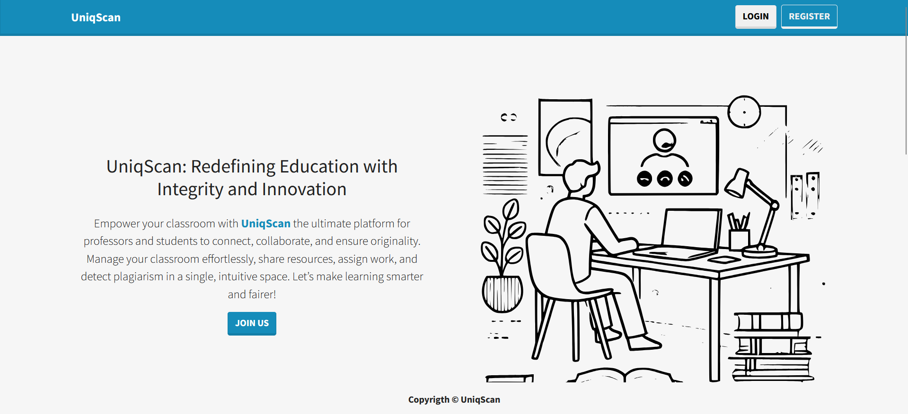
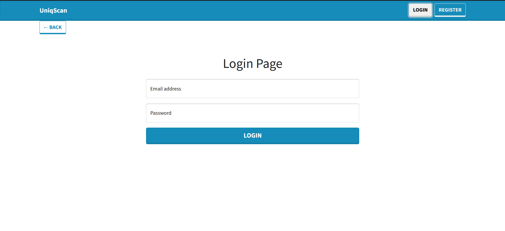
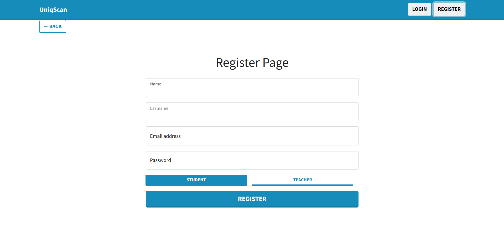
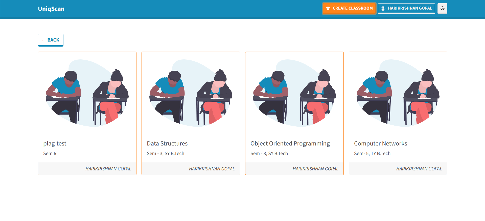
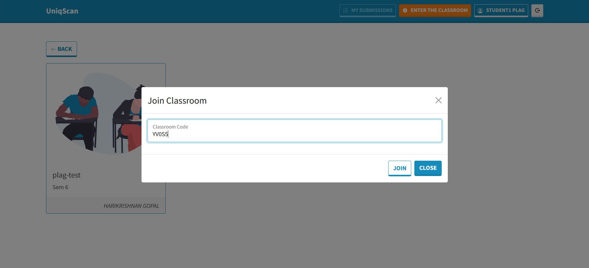
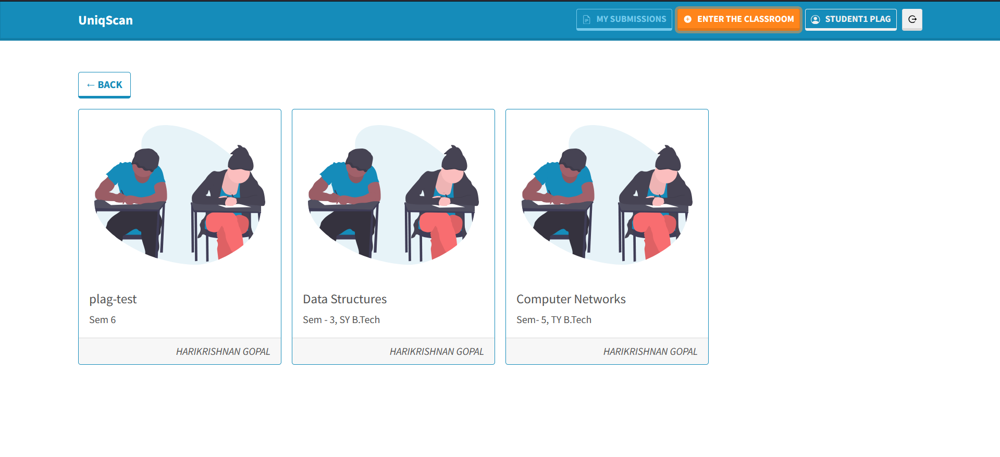
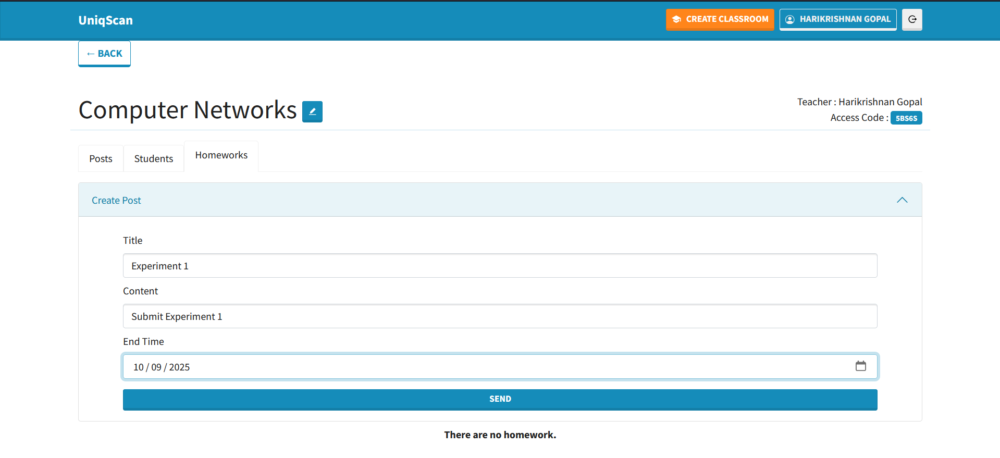

# UniqScan — AI Detection, Similarity, and Classroom Platform

UniqScan combines a MERN-style Classroom app with Python microservices for AI-content detection, PDF/OCR processing, and plagiarism/similarity analysis.

## Table of contents
- Features
- Tech stack
- Repository layout
- Architecture and data flow
 - Screenshots
- Environment variables (summary)
- How to run locally
- Python modules overview
- API overview
- Troubleshooting

## Repository layout

- `classroom/` — MERN app
  - `backend/` — Node/Express API, file uploads, ML integration
  - `frontend/` — React UI
  - `ML/` — Python services consumed by the backend
    - `AI_content/` — AI detector service (E5 LoRA)
    - `Similarity/` — Similarity/OCR/plagiarism service
- `ml_nlp-ocr/` — Standalone document watcher and OCR-to-Markdown pipeline
- `ai_text_detector/` — Sample detectors and clients (HF model, Gradio, RapidAPI)
- `Matcher_algo/` — Matching and plagiarism CLI utilities
- `models/` — Local cache for the HF detector model

See per-directory READMEs for details.

## Features

Classroom & users
- User accounts: register, login, JWT-based auth
- Classrooms: create/join with access codes, roster management
- Posts & discussions: share announcements/resources per classroom

Assignments
- Teacher: create assignments with title/description/deadline
- Student: submit files (PDF/DOCX/PPT/Images/TXT/CSV)
- Submission management: list who submitted, who’s pending

Grading & reporting
- Backend triggers ML grading on submission (asynchronous queue)
- Scores returned and stored per project:
  - Similarity score (%) vs local corpus
  - AI-generated content score (%) via E5 small LoRA detector
  - Overall plagiarism score and risk level
- Detailed, styled HTML report saved and accessible from UI

ML pipeline
- Public file URL served by backend `/uploads` for ML services
- Similarity/OCR service: downloads file, extracts text with OCR, compares vs corpus
- AI detector service: `/classify` returns AI probability for text
- Resilient fallbacks if ML is slow/unavailable (timeout handling and fallback report)

Operations & DX
- Config via `.env` files; timeouts and service URLs configurable
- MongoDB persistence for users, classrooms, posts, homework, submissions
- Logs and JSON artifacts for ML service runs; corpus grows automatically

## Tech stack

Frontend
- React 17, React Router, React Bootstrap, Axios

Backend
- Node.js, Express, CORS, Multer (uploads), JWT auth, Mongoose (MongoDB)

ML Services (Python)
- Flask microservices
- AI detection: PyTorch, Transformers, Hugging Face Hub
- Similarity/OCR: PyMuPDF (fitz), Tesseract (pytesseract), OpenCV, Pillow, NLTK, python-docx, python-pptx

Storage and infra
- MongoDB (Atlas or local)
- Local filesystem for uploads and generated reports

## High-level flow

1) Classroom users interact with the React frontend.
2) Backend stores data in MongoDB and handles file uploads under `classroom/backend/public/uploads`.
3) When a homework is submitted, backend calls the ML API (Python Similarity service) with a public URL to the uploaded file.
4) The Similarity service downloads the file, extracts text (PDF/OCR/etc.), compares against local corpus, calls the AI detector service, and returns scores plus an HTML report.
5) Backend returns those results to the frontend for display.

## Architecture and data flow

```
React Frontend (student submit) ──> Node/Express Backend (stores file under /uploads)
                                        │
                                        ├─ calls ML API /grade/analyze with file_url
                                        │
                                        ▼
                       Flask Similarity Service (download + extract text + compare corpus)
                                        │
                                        ├─ calls AI Detector /classify for AI %
                                        │
                                        └─ returns scores + HTML report
                                        
Backend persists results and serves report → Frontend displays scores and report
```
## Screenshots

Note: Place images in the repository root `assets/` folder as `1.png, 2.png, ...`.

1) Landing



2) Login



3) Register



4) Classroom view


5) Creating assignment


6) Assignment view (Teacher)



7) Report (HTML analysis)



8) Assignment submission (Student)



9) Grade view (Student)




## Environment variables (summary)

Backend (`classroom/backend/.env`)
- `MONGO_DB_URL` — Mongo connection string
- `CLIENT_URL` — allowed CORS origin (e.g., http://localhost:3000)
- `SECRET_ACCESS_TOKEN`, `ACCESS_TOKEN_EXPIRE`, `SECRET_REFRESH_TOKEN`, `REFRESH_TOKEN_EXPIRE` — JWT config
- `ML_API_BASE_URL` — Similarity API base URL (e.g., http://localhost:5000)
- `ML_API_TIMEOUT` — request timeout ms (default 300000)
- `BACKEND_URL` — optional explicit public URL for file links

Frontend (`classroom/frontend/.env`)
- `REACT_APP_BASE_URL` — Backend base URL (e.g., http://localhost:4000)

AI Content service (`classroom/ML/AI_content`)
- Optional `HF_TOKEN` if needed to pull the model

Similarity service (`classroom/ML/Similarity`)
- `AI_SCORE_API_URL` — e.g., http://localhost:5001 (the AI service base; `/classify` is appended)
- Tesseract must be installed; on Windows the default path is used automatically.

## How to run locally (Windows PowerShell)

Recommended order in separate terminals:

1) AI Detector service (port 5001)
```powershell
cd classroom/ML/AI_content
pip install flask torch transformers huggingface_hub requests
python e5-small-lora.py
```

2) Similarity service (port 5000)
```powershell
cd classroom/ML/Similarity
pip install flask requests nltk pytesseract pillow pymupdf opencv-python numpy python-docx python-pptx
$env:AI_SCORE_API_URL = "http://localhost:5001"
python app.py
```

3) Backend (port 4000 by default)
```powershell
cd classroom/backend
npm install
cp .env.example .env  # if you keep a template; otherwise create manually
npm run dev
```

4) Frontend (port 3000)
```powershell
cd classroom/frontend
npm install
cp .env.example .env
npm start
```

5) Optional: Standalone OCR watcher
```powershell
cd ml_nlp-ocr
pip install pytesseract pillow pymupdf watchdog opencv-python numpy tqdm python-docx python-pptx docling
python app.py
```

## Python modules overview

- `ai_text_detector/` — reference scripts for AI detection via local HF model, Gradio Space, RapidAPI.
- `ml_nlp-ocr/` — robust document watcher with OCR and Markdown outputs.
- `Matcher_algo/` — general-purpose n-gram matcher and a folder plagiarism CLI that emits HTML/TXT reports.

## API overview

- Backend API: Express routers under `classroom/backend/src/routers` expose users, classrooms, posts, and homework. Grading is orchestrated server-side via `gradingService.js`.
- ML API: See `classroom/backend/ML_API_DOCUMENTATION.md` for request/response contract used by the backend.
- AI Detector API: `classroom/ML/AI_content/e5-small-lora.py` exposes `POST /classify { text } -> { ai_score }` and `GET /health`.
- Similarity API: `classroom/ML/Similarity/app.py` exposes `POST /grade/analyze` and auxiliary endpoints.

## Troubleshooting

- Tesseract not found
  - Install Tesseract and ensure its path is correct. On Windows, default path is used automatically by the services.
- CORS errors in browser
  - Ensure backend `CLIENT_URL` matches the React origin and that CORS is enabled in `app.js`.
- ML API connection refused or timeout
  - Start AI Detector (5001) and Similarity (5000) first. Verify `ML_API_BASE_URL` in backend and `AI_SCORE_API_URL` in Similarity.
- File URL not accessible by ML service
  - Backend must serve uploads at `/uploads`. Confirm `getFileUrl` builds a reachable URL and `BACKEND_URL` is set if deployed.

## Notes & tips

- Ensure Tesseract OCR is installed and accessible on your system.
- The Similarity service grows its corpus in `classroom/ML/Similarity/extracted_text/` as you analyze more files.
- The backend serves uploads via `/uploads/...` so the Python service can fetch them by URL. Don’t disable this in production without providing an alternative access method.